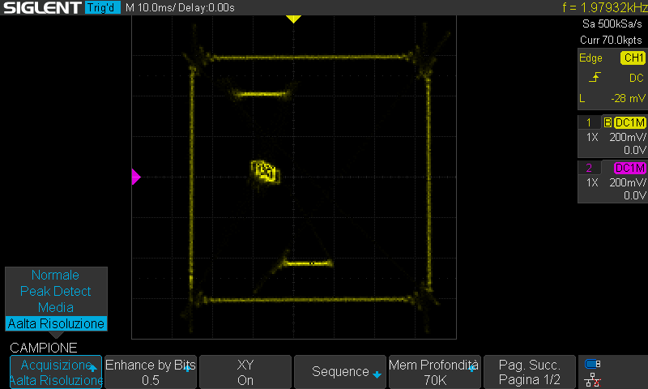

# XY Oscilloscope Pong

This Python project implements a version of the classic Pong game that is rendered directly on an XY oscilloscope using stereo audio output. The left and right audio channels control the X and Y positions, allowing you to visualize the game in real-time on an oscilloscope in XY mode.



---

## Table of Contents

1. [Features](#features)
2. [Dependencies](#dependencies)
3. [Installation](#installation)
4. [Usage](#usage)
5. [Configuration](#configuration)
6. [Controls](#controls)
7. [Example](#example)
8. [Troubleshooting](#troubleshooting)
9. [License](#license)

---

## Features

- Real-time Pong game rendered via XY oscilloscope.
- Left audio channel controls X-axis, right channel controls Y-axis.
- Simple AI opponent.
- Adjustable game parameters (paddle size, ball speed, field size).
- Python-based, lightweight and minimal dependencies.

---

## Dependencies

- Python 3.x
- [numpy](https://pypi.org/project/numpy/)
- [sounddevice](https://pypi.org/project/sounddevice/)
- curses (built-in on Linux/macOS, Windows requires `windows-curses`)

Install dependencies with pip:
# On Linux:
```bash
pip install numpy sounddevice
```
# On Windows:
```bash
pip install windows-curses
```


## Installation

1 Clone the repository:
```bash
git clone https://github.com/yourusername/xy-oscilloscope-pong.git
cd xy-oscilloscope-pong
```

2 Install dependencies (see section above).


## Usage

Run the game from a terminal:
```bash
python3 simple_pong.py
```

Notes:
-Ensure your stereo output is connected to the oscilloscope (Left = X, Right = Y).
-The game will render the field, paddles, and ball directly as audio signals.
-Press CTRL+C to exit.


## Configuration

You can adjust the following parameters at the top of the script:

samplerate – Audio sample rate (default 48000 Hz)

frame_time – Frame duration in seconds (default 0.05 s)

scale – Field scaling

paddle_w / paddle_h – Paddle width and height

ball_size – Ball size

ball_dx_init / ball_dy_init – Initial ball speed

paddle_points, field_points, square_points_per_side – Number of points to render shapes smoothly


##  Controls

Left Arrow – Move player paddle left

Right Arrow – Move player paddle right

Up Arrow – Launch ball from paddle


## Example

Connect your stereo output to an XY oscilloscope and run:

```bash
python3 simple_pong.py
```

You should see the Pong field and the ball moving in real-time according to your audio signal.


## Troubleshooting

- No output on oscilloscope: Verify stereo output is properly connected and the oscilloscope is in XY mode.

- Game not responding to keys: Ensure the script is running in a terminal that supports curses.

- Windows issues: Install windows-curses via pip.


## License

This project is released under the MIT License.

